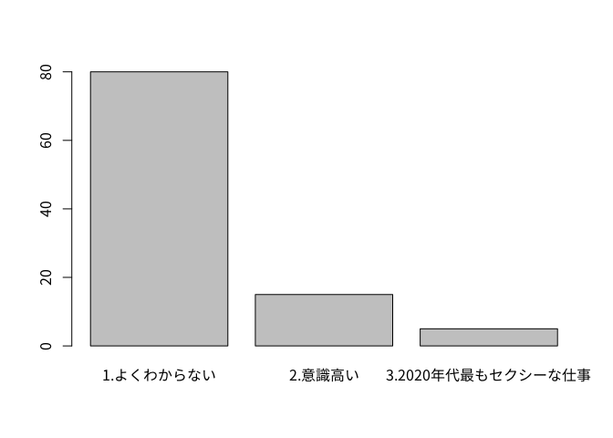

Marketing Science with R
================
TokyoR \#78 Kien Knot(きぬいと; @0\_u0)
2019/5/25

## 自己紹介

  - 労働者階級2年目
      - マーケティング系調査屋さんのアナリスト
          - <b>兼</b>アナリスト候補のヘッドハンター
          - <b>兼</b>部署内作業環境改善係
          - <b>兼</b>広報担当
  - 最近の出来事
      - 転職しないことにした
          - キャリアなんもわからん問題でバズってしまった
          - なお今もなんもわからん模様
      - OSをUbuntuに変えたらMSOffice使えないじゃない……

## 宣伝

  - Statistician-jaのDiscordをつくりました
      - 「数理統計学」をやっていくサーバ
          - 「10人くらいかなあ」
  - 今では300人超えてきた
      - FF外からいっぱい来た
      - 界隈のドンからも反響があった

## 宣伝

<div style="text-align: center;">


</div>

## 嬉しい悲鳴

  - PythonとかRとかではなく「数理統計」のお勉強をやろう
      - `lm(y~., data = dat)`の裏のロジックをつかもう
      - 理論は廃れないのでみんなで理解しよう
  - 目標は統計検定1級に合格することなど
  - <https://discord.gg/Nq75Smp>にアクセス！
      - Meetupとかも構想中です。
      - 運営の仕方とか教えてほしい

## 今日のお話

  - 「Rって非Tech系企業でどう使われているんですか？」なお話
      - R:
            エンジニアじゃない人も割と使ってる
      - 故に「バージョン管理」とかよく分かってないことも……
          - 最近社内で[Uribo先生の資料](https://speakerdeck.com/s_uryu/rstudio-for-team)を紹介しました
  - マーケティング・リサーチ業界でのお話
      - 偏見があります
  - R要素は？
      - これがRmarkdownでできている
      - それで十分じゃないか……？
      - ioslideの無骨さいい……

# 「マーケティング」って何？

## 実際に聞いてみた<font size = "5">い</font>

  - Q.「マーケティングってなんだと思いますか？」

<!-- -->

## きぬいともよくわかんない

  - 「ドリルを買う人は、ドリルがほしいんじゃなくて、穴がほしいんだよ」

<div style="text-align: center;">


</div>

  - 新人だったころのきぬいと「胡散臭い」

## 「マーケティング」のよくわからなさ

  - どうなったら「うまくいった」と言えるのかが<b>よくわからない</b>
      - 測定指標(KGIだのKPIだの)の定義がTPOによって異なる
          - あるいは大きく定義変更がなされる
  - 指標の測定方法も<b>よくわからない</b>
      - この辺は実験計画法とか結構大事
      - でも<b>よくわからない</b>まま実行しがち
  - データ活用法のよくわからなさ
      - 大体の日本企業はデータはある
          - 「何がわかれば利益につながるのか」<b>よくわからない</b>
      - 選択肢が多すぎると逆に選べない
      - どんなデータがあると何がわかるのか<b>よくわからない</b>

## 

<div style="text-align: center;">

<font size = "40">なんもわからん</font>

</div>

<div style="text-align: center;">


</div>

# データは使いたい

# でもデータ活用は進まない

## 

<div style="text-align: center;">

<font size = "40">Just You Know Why</font>

</div>

<div style="text-align: center;">


</div>

  - 知らない人は「panda チーズ」でググって

# 理由1. KKD信仰

## KKD（経験・勘・度胸）

  - 実際その道のベテランのK・Kは馬鹿にはできない(くやしい)
      - 実際Dなしに決定はできない(それはそう)
  - データ分析の価値もKKDに合うかどうかで決まるところもある
      - 「合っているかどうか」を評価する基準が定義できない  
      - 結果「経験」「勘」に頼らざるを得ない

# 理由2. Excel信仰

# 「Excelでできるじゃん」

# 反論できず悔しい

# わかる

## 「Excelでなんでもできるじゃん」

  - <b>「なんでもはできないわよ、できることだけ」</b>
      - Excelでの手計算のミスが業務の8割を占めた2018年度
      - 誰もやりたくてやらかすわけじゃない
  - 「できる」から「効率化」へ
      - 「Excelでできる」は「最適解」とは限らない
          - ちょっと仕様が変わると詰みがちなVBA
          - エンジニアリングしなくても実装できる関数
          - 進まないバージョン管理

## その結果

  - 【きぬいと編集】案件結果\_上司確認\_ver2\_2019xxxx.xls

<div style="text-align: center;">


</div>

# 非Tech系データ分析

## 仕事の8割が記述統計

  - `table`や`ggplot`で解決する問題が大半
      - そもそも誰もデータを見ていない
          - 故にKPIもKGIもよくわからない
      - 分布や単純なクロス集計だけでも発見があることが多い
          - ここで初めてどの指標の評価をするかも判断できる
  - 予測や分類はこの次のステップ
      - データをちゃんと見せよう
      - <b>魅せる</b>ことすら時期尚早

## 非Tech的Rの記述

  - 記述統計レベルで解決する場合が多い
      - と言いつつそこそこデータ量が多い
  - ある業務でのきぬいと

<!-- end list -->

``` r
  dat <- datA %>% 
    dplyr::group_by(ID, date) %>% 
    dplyr::summarise(count = n()) %>% 
    tidyr::spread(.,key = date, value = count) %>% 
    dplyr::mutate_if(is.numeric, funs(replace(.,is.na(.),0))) %>% 
    dplyr::ungroup()
```

  - これでログ形式のデータからIDと時系列別に何かをカウントして横展開とかする
      - そして平均とか行和列和とか見ながらグラフ出すとか

## 出力

``` r
dat[,1:10] %>% head
```

    ## # A tibble: 6 x 10
    ##      ID `100` `101` `102` `103` `104` `105` `106` `107` `108`
    ##   <int> <dbl> <dbl> <dbl> <dbl> <dbl> <dbl> <dbl> <dbl> <dbl>
    ## 1     1     1     0     0     0     0     0     0     0     0
    ## 2     2     0     1     0     0     0     0     0     0     0
    ## 3     3     0     0     1     0     0     0     0     0     0
    ## 4     4     0     0     0     1     0     0     0     0     0
    ## 5     5     0     0     0     0     1     0     0     0     0
    ## 6     6     0     0     0     0     0     1     0     0     0

## つまり？

### 整　然　宇　宙　開　発　局

<div style="text-align: center;">


</div>

## 冗談抜きで

  - `tidyverse`で既存業務がだいぶ改善した
      - 残業時間を大幅に減らしたらストレスが減った
      - 上司が助かっているかはわからない……助かっていると信じたい
  - でかいExcelファイルを開くのに待つ必要性がだいぶ減った
  - `ggplot2`やら`DiagrammeR`やらでの可視化で表を見やすくできる
  - いいぞ

## お客様の声

  - 「この動きは知らなかったなあ」
  - 「ライバルと比べるとこうなっているのか」
  - 「ここからこういうことできますか？」

## 結論

  - Marketing Scienceは記述統計から入ろう
      - 回帰分析とか誰も知らない
      - よくあるご質問「切片は誤差ですか？」
  - Statisticの語源に忠実にいこう
      - state/status「状態」の記述
      - <b>マーケティングで推定とかそんなの魔法っすよ。</b>

## 今後

  - 研修とかのためにこれまでのTipsをドキュメント化する
      - Rmdでいけんじゃね？
          - たまにPython使うけど
          - PythonもRmdでまとめられるんじゃね？
  - R開発環境の統一
      - バージョン管理がめんどい
          - 未だに社員のローカル環境依存
          - こんな課題を解決したい（エンジニア発想）
      - Docker使えばなんとかなんじゃね？
      - 鋭意開発中
          - この辺知ってて一緒に働きたい人も募集中

# Enjoy\!\!
